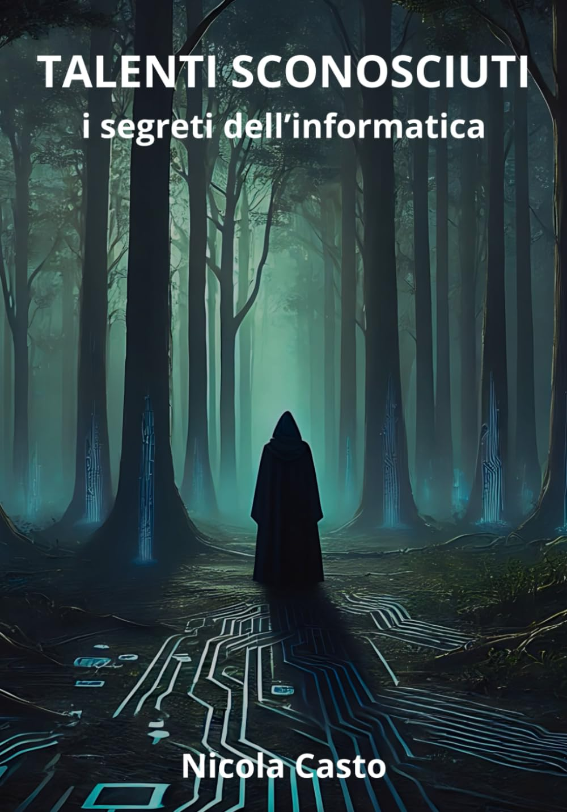

# talentisconosciuti 
Repository del libro Talenti Sconosciuti - I segreti dell'informatica

# 📖 TALENTI SCONOSCIUTI: i segreti dell'informatica

> *"Come Dante si addentrò nella selva oscura guidato da Virgilio,  
> questo libro ti accompagnerà nel mondo digitale — svelandone  
> i lati nascosti, uno per uno, senza lasciare nulla nell'ombra."*  

## Perché questo libro esiste

Non è stato scritto per impressionare nessuno.

È nato dalla voglia genuina di aprire le porte di un mondo meraviglioso — l'informatica — a chiunque non abbia mai avuto l'occasione di esplorarlo davvero.
Un mondo che chi lo vive ogni giorno conosce come una seconda casa, ma che per molti resta ancora misterioso, lontano, quasi inaccessibile.
Sei davvero sicuro di navigare in sicurezza? Sai chi decide quali informazioni vedi online e quali no? Sai chi sono davvero gli hacker — e perché i media ti raccontano solo metà della storia?
Questo libro risponde a queste domande. Non servono lauree, non servono corsi costosi. Serve solo la curiosità di capire come funziona davvero il mondo in cui viviamo.
Scritto con il cuore, per condividere una passione.

## 🎯 Per chi è scritto
Adatto a **studenti**, **neofiti** e a chiunque voglia finalmente capire cosa si nasconde davvero dietro uno schermo — senza tecnicismi inutili, con linguaggio semplice e diretto.

## 📚 Il viaggio in 6 capitoli

### 🔭 Cap. 1 — Quello che vedi è nulla
Dietro ogni smartphone, ogni PIN bancario, ogni click online si nasconde un mondo invisibile. I veri informatici lavorano nell'ombra — e questo libro li porta finalmente alla luce.

### ⚙️ Cap. 2 — La materia incompresa
Da Alan Turing ai garage di Steve Jobs e Bill Gates, da Linux a Windows: la storia vera dell'informatica, quella che nessun libro di scuola ti ha mai raccontato.

### 🧠 Cap. 3 — L'informatico: identikit del genio visionario
Chi è davvero un informatico? Un ritratto umano e autentico di chi ha cambiato l'umanità spesso senza ricevere alcun riconoscimento. Programmatori, sistemisti, esperti di sicurezza, 
specialisti AI: talenti sconosciuti che muovono il mondo.

### 🔐 Cap. 4 — Sicurezza informatica e consapevolezza digitale
Hacker, ransomware, cybercriminali: cosa c'è di vero nei titoloni dei giornali e cosa è solo allarmismo? La verità su come proteggersi davvero nel mondo digitale.

### 🚀 Cap. 5 — Digitalizzazione e futuro
Bitcoin, istituzioni impreparate, leggi scritte da chi non conosce la materia. Il futuro digitale spiegato senza filtri, a chi lo deve capire prima di poterlo governare.

### 🤖 Cap. 6 — Intelligenza artificiale e intelligenza naturale
L'AI fa davvero paura? Cosa c'è di reale e cosa è fantascienza? Una guida lucida per orientarsi nel fenomeno tecnologico più discusso — e più frainteso — del nostro tempo.

## 🎁 Bonus inclusi
- 📖 **Glossario completo** — i termini del mondo digitale spiegati in modo che chiunque possa capirli
- 🔑 **Libro delle password** — uno strumento pratico per iniziare subito a proteggere la propria sicurezza digitale

## 📥 Scarica il PDF gratuitamente

Clicca sul file **TALENTI_SCONOSCIUTI_i_segreti_dell_informatica.pdf**  poi sull'icona ⬇️ in alto a destra.

Versione **cartacea**:  
👉 [Disponibile su Amazon] https://amzn.eu/d/0ixP5BbD - "Al prezzo ridicolo di stampa".

⭐ Se il libro ti è piaciuto, lascia una recensione a 5 stelle su Amazon e dai una stella a questo repository — aiuta altri a trovarlo!

## 📜 Licenza
© 2024 Nicola Casto — Licenza [CC BY-ND 4.0](https://creativecommons.org/licenses/by-nd/4.0/)

Come i programmatori open source regalano il loro codice al mondo, questo libro viene distribuito gratuitamente con lo stesso spirito: la conoscenza non dovrebbe avere barriere.
Chiunque può scaricarlo, leggerlo e condividerlo liberamente. L'unica cosa che chiedo è che il contenuto resti integro, così come è stato scritto — con il cuore.

✅ Libera distribuzione e lettura; ❌ Vietata la modifica; Se vuoi usarlo all'interno dei tuoi testi devi citare l'autore;

## 💬 Contribuisci alla seconda edizione

Questo libro è nato dalla condivisione e vuole continuare a crescere grazie alla comunità.

Se hai letto il libro e vuoi contribuire — che si tratti di un errore da correggere, un argomento dimenticato, un capitolo nuovo da proporre o semplicemente un suggerimento — scrivimi.

Ogni idea è benvenuta. Proprio come nel mondo open source, il contributo di chi legge può migliorare quello che verrà.

📧 Puoi contattarmi su:
- **GitHub** —  in questo repository
- **LinkedIn** — https://www.linkedin.com/in/nicolacasto/
  
La seconda edizione si costruisce insieme. 🙏
